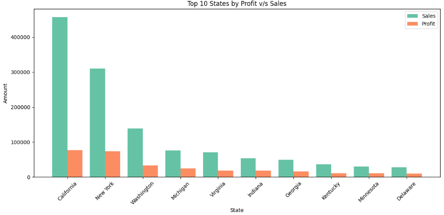
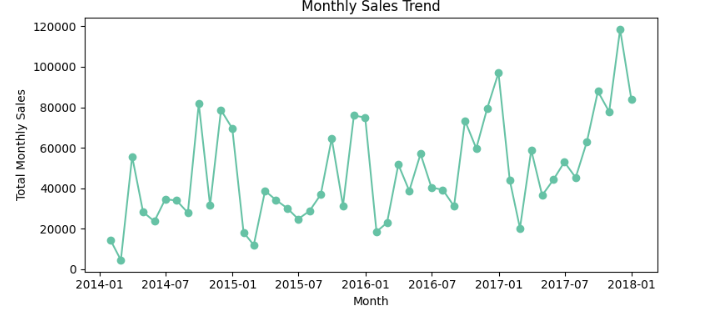

# Superstore Data Analysis

This project looks at a sales dataset from a Superstore. I worked with the Superstore sales dataset, which has 10,000 orders from 2014 to 2017. I started by looking at the Superstore sales dataset to understand
what it looks like and what kind of information it contains. I wanted to know what is present in the Superstore sales dataset and whether the data quality is good.

Then I analyzed the customers who buy from the Superstore, the types of products the Superstore sells, when customers place orders, and where Superstore customers are located. For every analysis performed on 
the Superstore sales dataset, I explain what I did, why I did it, and what it means for the Superstore business. The goal was to understand whether the Superstore can grow and improve, or if there are specific 
areas that need attention. The analysis uses charts and numerical metrics to support decision-making around marketing focus, inventory planning, and business expansion. All insights are explained in a simple and 
easy-to-understand way so they can be used to make informed decisions about marketing, inventory, and expansion strategies.

## Data Overview & Validation

I loaded the dataset, which contains detailed information for 9,994 orders across 21 fields. These fields include Order ID, Order Date, Customer details, Segment, Region, Category, Sales, and Profit. 
Each row represents a single order with all relevant attributes.

I performed a data quality check to identify missing values or duplicate records. The dataset was very clean, with no missing values or duplicate entries found. Because of this, I did not need to perform 
extensive data cleaning and could directly proceed with the analysis using reliable data.

For basic validation, I verified the time range from 2014 to 2017 and ensured that data types such as dates and numerical values were correctly formatted. This step is important because it ensures that trends,
aggregations, and calculations derived later are accurate and trustworthy.

## Customer Segment Analysis

I identified three customer segments: Consumer, Corporate, and Home Office. I analyzed order distribution across these segments to understand which customer types drive the business.

Most orders come from the Consumer segment, which accounts for approximately 52% of total orders. The Corporate segment contributes around 30% of orders, while the Home Office segment accounts for about 18%. 
This shows that the majority of orders come from individual consumers purchasing for personal use.

### Customer Segment Distribution

When analyzing sales by segment, the same pattern appears. The Consumer segment contributes about 54% of total sales, Corporate contributes roughly 33%, and Home Office contributes around 20%. While the Consumer
segment places the highest number of orders, the Home Office segment places fewer but often larger orders.

### Median Order Value

I examined how much customers spend per order on median : 

* Corporate orders are generally larger than Consumer orders($56.54).
* Then comes the Consumer segment($53.72).
* Home Office orders are smallest on median ($52.44).

This indicates that Corporate and Home Office customers tend to spend more per order compared to individual consumers. Because of this, it would be beneficial to prioritize Corporate and Home Office customers,
as their orders are more valuable.

### Profit Margin by Segment

I calculated profit margin for each segment by dividing total profit by total sales. The Home Office segment performs best with a profit margin of 14.0%, followed by Corporate at 13.0%, and Consumer at 
approximately 11.6%.

This means that even though the Home Office segment generates lower sales volume, it delivers higher profitability per sale. Improving service or increasing sales in this segment could result in faster profit 
growth.

In terms of quantity sold, the Consumer segment leads with 19,521 items sold, followed by Corporate with 11,608 items and Home Office with 6,744 items. Since the Consumer segment drives high order volume and 
item quantity, inventory management for popular Consumer products is critical.

### Discounts

I analyzed discount behavior across customer segments using median discount values to avoid distortion from extreme promotional orders.

The Consumer and Corporate segments both receive a median discount of approximately 20%, indicating a largely uniform discounting strategy across these two segments. In contrast, the Home Office segment shows a median discount of 0%, suggesting that most orders in this segment are placed without any discount.

This pattern implies that discount-driven promotions are primarily focused on Consumer and Corporate customers, while Home Office buyers tend to purchase at full price. If growth in the Home Office segment is a business objective, introducing targeted discount campaigns or personalized offers could help stimulate demand.Overall, Consumer customers continue to drive order volume and revenue. However, Corporate and Home Office segments demonstrate higher value per transaction, making them important targets for profitability-focused and long-term retention strategies.

## Product Category & Sub-Category Analysis

### Categories Overview

The Superstore sells three main categories: Technology, Furniture, and Office Supplies. I aggregated sales by category to determine which contributes most to revenue.

Technology leads with approximately $836k in sales (~36% of total revenue). Furniture follows with around $742k, and Office Supplies contributes about $719k. Sales are fairly balanced across categories, with 
Technology performing slightly better.

### Sub-Category Analysis

The top-selling sub-categories are Phones ($330k), Chairs ($328k), Storage ($224k), Tables ($207k), and Binders ($203k). Phones (Technology) and Chairs (Furniture) are the biggest revenue drivers.
These products are essential for business operations, so ensuring consistent availability is critical. There is also an opportunity to cross-sell complementary products with these high-demand items.

### Profitability by Category

Technology and Office Supplies have strong profit margins of around 17%, while Furniture performs poorly with a margin of approximately 2.5%. High-selling Furniture items such as Chairs, Tables, and Bookcases
generate very low profit, suggesting high costs or aggressive discounting.This indicates a need to review Furniture pricing or supplier costs. In contrast, high-margin items such as technology accessories and
office supplies should be promoted more aggressively.

Office Supplies like Labels, Paper, and Envelopes generate profit margins above 40%, making them highly profitable. While Technology phones and Furniture chairs drive revenue, smaller office supplies contribute
disproportionately to profit. Bundling high-demand items with high-margin products could improve overall profitability.

## Geographic (State and Regional) Analysis

I analyzed performance across states using a bubble chart where the x-axis represents number of orders, the y-axis represents sales, **and bubble size indicates profit**. California and New York stand out with
high order volume and high revenue. California’s bubble is the largest, indicating it generates the highest total profit.

### Orders vs Sales (Bubble Chart)

I then compared the top 10 states by sales and profit using bar charts. While California and New York dominate sales, states such as Michigan, Virginia, and Washington appear among the top profit contributors
despite lower sales.California and New York have high sales but relatively lower profit margins (around 17%), likely due to higher operating costs or intense competition. These regions require efficiency 
improvements or premium pricing strategies. 

### Sales vs Profit by State

States like Michigan, Virginia, and Washington have high profit margins (Michigan ~32%), indicating efficient operations. These states represent strong expansion opportunities.Regionally, the West performs 
best with approximately $725k in sales and $108k in profit, followed by the East. Central and South regions underperform, suggesting untapped growth potential.

## Shipping & Discount Insights

Most orders (around 60%) use Standard Class shipping, followed by Second Class (20%), First Class (15%), and Same Day (5%). This indicates customers are generally price-sensitive and willing to wait longer for
delivery, allowing the business to control shipping costs.Discount analysis shows similar discount levels across all segments, suggesting a uniform pricing policy. Segment-specific or product-specific discounts
could be explored to drive targeted growth.

## Sales Trends Over Time

### Yearly Growth

I analyzed yearly sales trends from 2014 to 2017. Sales declined slightly from 2014 to 2015 but increased sharply afterward. Sales in 2016 were approximately 30% higher than in 2015, and sales in 2017 grew 
another 20%. This shows strong and consistent business growth.

### Quarterly Patterns

Quarterly analysis reveals a clear seasonal pattern. Sales peak every fourth quarter, with Q4 2017 reaching approximately $280k. Sales are usually slower in Q2, increase in Q3, and surge during the holiday season. This highlights the importance of inventory and workforce planning ahead of Q4.

### Monthly Trends

Monthly analysis confirms end-of-year sales spikes and shows a steadily rising baseline over time. Early 2018 monthly sales are higher than the same months in previous years, indicating sustained momentum.
Overall, time-based analysis confirms consistent growth and strong seasonality, with predictable demand peaks during the holiday period.

### Sales Trend Over Time

---

## Key Takeaways

- Sales are growing steadily with strong seasonality.
- Consumer customers drive volume; Corporate and Home Office drive value.
- Office Supplies are the most profitable category.
- Furniture needs pricing or cost optimization.
- Expansion opportunities exist in high-margin and under-penetrated regions.

### Sales Heatmap by Region/State

  
This analysis combines data validation, visualization, and business interpretation to translate raw sales data into actionable insights that support strategic decision-making.
